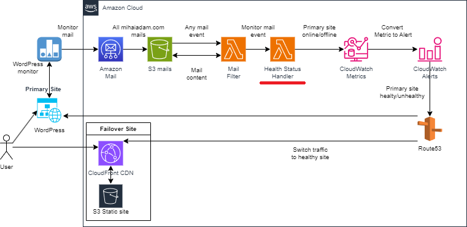

# Health Status Metric

## 1. Overview
This is a Lambda function that receives a message with the online status of a webserver, convert it to health status and send it to CloudWatch Metrics service.
The Lambda function took part from an AWS Cloud solution for a failover mechanism for the main site: [mihaiadam.com](https://mihaiadam.com). The failover site is a static one deployed with AWS services: S3, CloudFront, Certificate Manager, and runs simultaneously with the main site. 
Online status monitoring for main WordPress site is done using WordPress Jetpack plugin. The online status is converted to health status, monitored by Route53 DNS, that makes the switch among the main and failover websites.
This lambda is presented in below architecture highlighted in red.

## 2. Application functionality
The project is a Maven project that contains the Lambda function highlighted in the above architecture diagram. It can be built, but the deploy in AWS Cloud will not work as an application due to missing dependencies.
The tests could ran in Eclipse due to Mockito data injections in the mocks of the AWS SDK clients, thus all the original code of the Lambda will run with mock data from real sources (S3 mails, SNS event)

## 3. AWS SDK & Java SDK features used
- The log is done in all application using Log4j2, that sends output to AWS CloudWatch service
- Each AWS client used is encapsulated in a POJO application service
- Use AWS SDK V2 CloudWatch Client to add metric data in CloudWatch Metrics service
- Use AWS SDK V2 S3 Client to load EML file from S3
- Deploy of AWS Lambda Function is done from the build process configured in pom.xml 
- Use Mockito test frameworks to mock AWS clients; Thus, all the layers (handler,service,model) of the application, in their original form, are tested
- Use AspectJ to trace the execution of methods in local and cloud environments
- Use AWS SDK Java V2
- Use Java Mail to search in EML file from S3
- Javadoc ready
